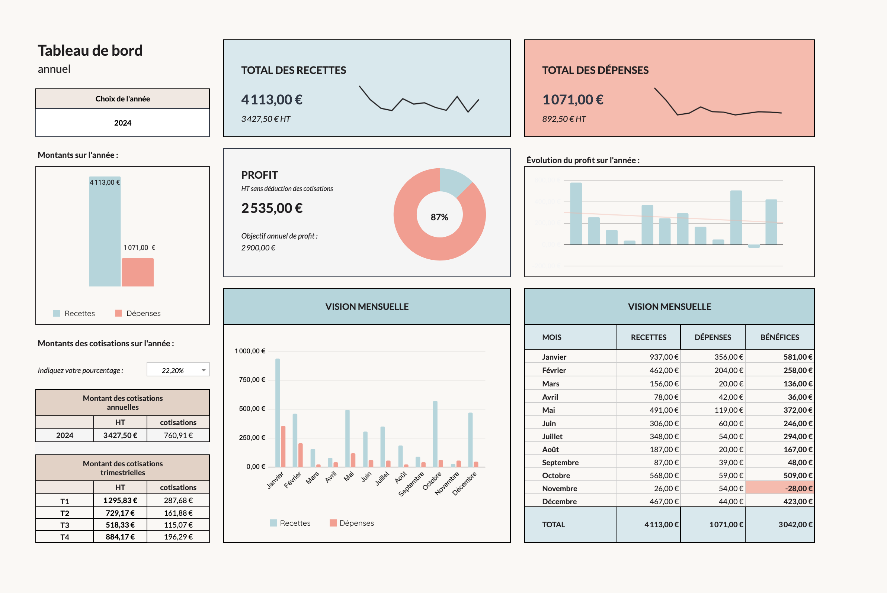

# 📊 Dashboard financier — Excel

Conception d'un **outil de suivi et d'analyse financière sur Excel et Google Sheets**, destiné aux entrepreneurs individuels, quel que soit leur secteur d'activité.

## 🎯 Objectif

L'objectif était de concevoir un outil suffisamment simple et polyvalent pour pouvoir répondre aux besoins d'un grand nombre d'entrepreneurs individuels.

Le dashboard permet de centraliser et structurer les principales données financières de l'activité afin d'obtenir une vision plus claire de :

- leurs recettes
- leurs dépenses
- leur profit
- l'évolution de leur activité dans le temps

L'enjeu était de transformer des données financières parfois dispersées en **indicateurs clairs, lisibles et facilement exploitables** au quotidien.

 

## 📊 Fonctionnalités

- Suivi des recettes et des dépenses
- Analyse du profit
- Suivi de l'évolution de l'activité dans le temps
- Tableaux de bord synthétiques
- Automatisation des calculs
- Visualisation des données
- Organisation pensée pour faciliter la saisie et la lecture

 

## 🛠️ Outils & compétences

- Microsoft Excel
- Formules avancées
- Structuration des données
- Création de KPI
- Data visualisation
- Automatisation
- Dashboard design
- UX / expérience utilisateur

 

## 📷 Aperçu

L'ensemble des vues du dashboard est disponible dans le dossier [`Dashboard`](Dashboard/).

 

## 💡 Approche

Au-delà du suivi financier, l'objectif était de concevoir un outil qui puisse être **facile à comprendre et agréable à utiliser**, y compris pour des utilisateurs qui ne sont pas familiers avec l'analyse de données.

La conception combine ainsi **structuration des données, automatisation, analyse, visualisation et expérience utilisateur**.

 

## 📌 À propos du fichier

Le fichier complet est disponible sur ma boutique en ligne.  
Il n'est donc pas publié dans ce repository, mais les différentes captures d'écran permettent de visualiser la structure et les fonctionnalités du dashboard.
